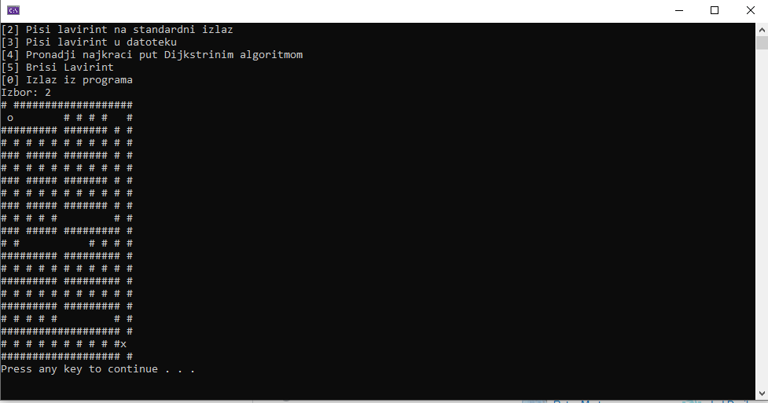
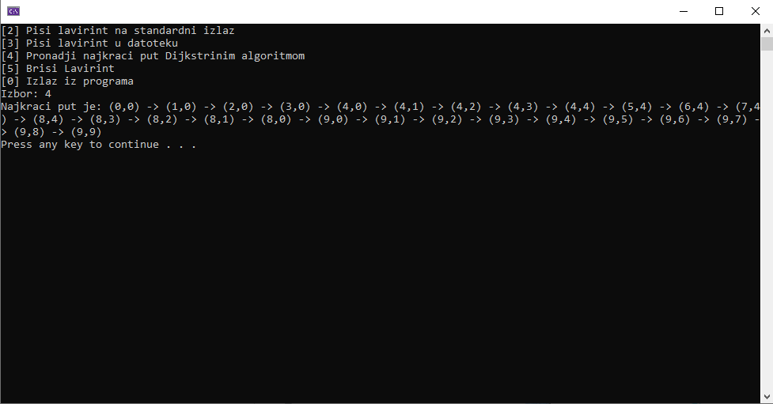

# mazeSolver

## Project Description

A maze solver that represents the maze as a symmetric **graph** and then solves it using **Djikstra's shortest path algorithm**. The solver can solve any maze that can be represented by a matrix. It features easy maze creation and can even print the maze to a file.

This project was written in C++ as part of the Algorithms and Data Structures course at the University of Belgrade School of Electrical Engineering (ETF). The project has **fulfilled all requirements and was has received the maximum grade**.

 